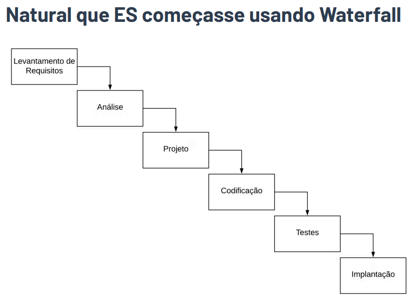

# Integralizei UNB

Tema proposto pelo squad 9 

A época de matrícula é um momento de grande expectativa e, muitas vezes, de angústia e decepção. Aquele professor incrível, cujas aulas são sempre disputadas, gera inúmeras dúvidas na cabeça dos alunos:

> *"Será que eu consigo com ele?"*
> 

> *"E se eu não passar e ficar sem a vaga?"*
> 

> *"Acho que vou tentar um professor mais fácil, só para garantir..."*
> 

Nós conhecemos de perto esse sentimento. Já sentimos o nervosismo de atualizar a página do SIGAA, torcendo por um resultado positivo. Foi exatamente dessa experiência que nasceu a ideia do **INTEGRALIZEI UNB**: uma ferramenta pensada para acabar com o "achismo" no momento mais crucial do semestre.

Com apenas o seu histórico, nossa plataforma analisará e prevêrá qual a sua chance aproximada de garantir a vaga com o professor que você tanto quer. Como? Utilizando uma base de dados com informações de alunos que já cursaram essa mesma disciplina. Assim, em vez de ansiedade, você terá o poder dos dados para planejar seu semestre com mais confiança e tranquilidade.

## Como o backend funcionaria

Para criar o **INTEGRALIZEI UNB**, nosso backend será construído com quatro conceitos fundamentais.

### 1 - Coleta de dados

O sucesso da nossa análise depende da qualidade e quantidade de dados. Nossa estratégia de coleta será dividida em duas fases:

- **Fase 1 (Pré-lançamento):** Iniciaremos com uma base de dados menor, coletada através de envios voluntários. Isso nos permitirá treinar nossos modelos e garantir que a plataforma já seja útil desde o primeiro dia.
- **Fase 2 (Site ativo):** Com o site no ar, os próprios usuários poderão fazer o upload de seus históricos. Este processo será simples, rápido e seguro.

O tratamento dos dados é de extrema importância, dados sensíveis como nome, CPF e matrícula são **imediatamente descartados** e nunca armazenados.

### 2 - Extração de dados

A fase de extração de informações é a mais crítica, já que os históricos em PDF possuem estruturas inconsistentes que dificultam a leitura por um software comum. Para resolver esse problema, utilizaremos um agente de Inteligência Artificial. Ele será capaz de analisar o PDF e facilmente nos devolver os dados que precisamos no formato necessário.

### 3 - Armazenamento de dados

Os dados extraídos precisam ser organizados em um banco de dados para que possam ser consultados de forma eficiente. Um banco de dados relacional (SQL), ainda estamos vendo quais bancos usaremos.

### 4 - Logica de Análise

Para comparar os dados dos usuários utilizaremos o sistema oficial de “ranqueamento” da UNB:

